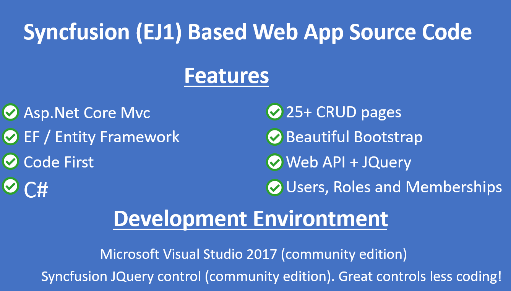
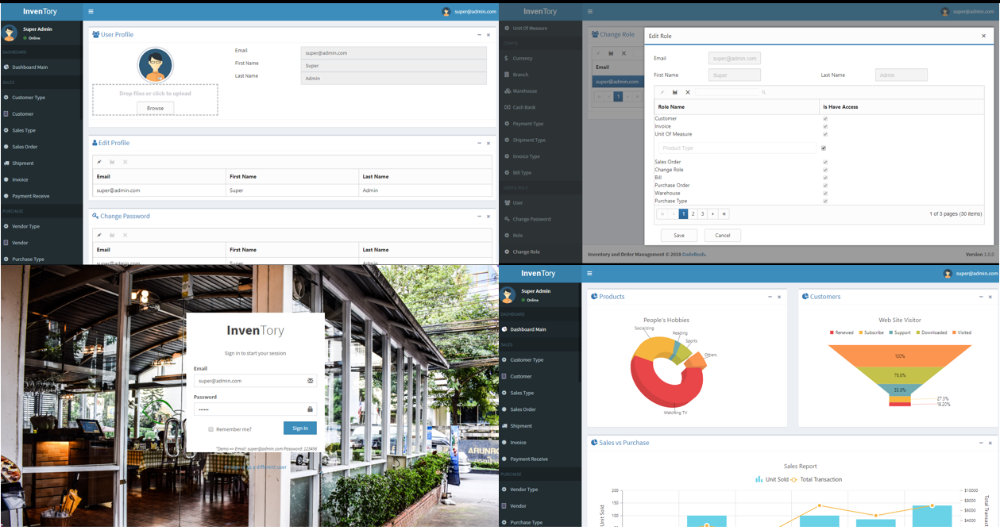

# Asp.Net-Core-Inventory-Order-Management-System
Project example Asp.Net Core Mvc implementation of inventory order management system. warehouse, product, vendor, customer, purchase order, sales order, shipment, goods receive and more.

# Features

- Asp.Net Core Mvc
- EF / Entity Framework
- Code First
- C#
- Beautiful Bootstrap
- Web API + JQuery
- SendGrid
- Upload Profile Picture
- Edit Profile
- Change Password
- Users, Roles and Memberships
- 25+ CRUD Forms

# Functional Features

- Dashboard / Chart Example
- Sales
  - Customer Type
  - Customer
  - Sales Type
  - Sales Order
  - Shipment
  - Invoice
  - Payment Receive
- Purchase
  - Vendor Type
  - Vendor
  - Purchase Type
  - Purchase Order
  - Goods Received Note
  - Bill
  - Payment Voucher
- Inventory
  - Product
  - Product Type
  - Unit of Measure
- Config
  - Currency
  - Branch
  - Warehouse
  - Cash Bank
  - Payment Type
  - Shipment Type
  - Invoice Type
  - Bill Type
- User & Role
  - User
  - Change Password
  - Role
  - Change Role

# Development Tools & Environment

- **Visual Studio 2017 (Community Edition)**. (https://visualstudio.microsoft.com/) 
- **Syncfusion JQuery Controls EJ1 (Community Edition)**. (https://www.syncfusion.com/products/communitylicense)

# Supported by CodeRush.Co
[CodeRush.CO] source code collections (https://coderush.co). 50% Off All Products, Use Discount Code **GITHUB50**

